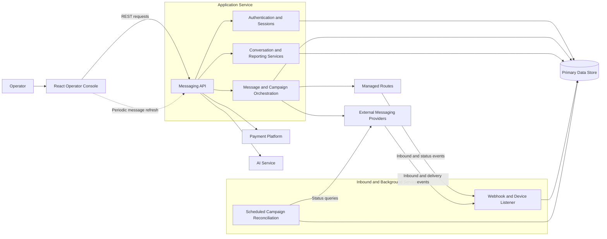

# ALL SMS — Production Messaging Platform Case Study

## Overview

ALL SMS is a production business-messaging platform for managing customer conversations, outbound SMS/MMS campaigns, message history, delivery state, reporting, and account balances from one operator interface.

The central engineering problem was not simply sending a message. The system had to coordinate two materially different delivery models:

- capacity-limited managed messaging routes; and
- external-provider campaign workflows with their own accounts, templates, imports, throttling, and status models.

Both paths needed to share customer data, compliance filtering, message records, job summaries, billing behavior, and operator workflows without pretending that the underlying transports behaved identically.

This case study describes the implemented architecture at a public-safe level. It contains no production source code, customer data, credentials, internal identifiers, or proprietary provider configuration.

`Core stack:` TypeScript, React, Node.js, Express, MySQL, REST APIs

## Production Context

ALL SMS operates as a real production messaging platform with more than 10 million outbound message records and hundreds of thousands of inbound responses processed across its operational history. The platform has handled peak daily volume exceeding 200,000 messages while maintaining shared customer, compliance, billing, and delivery-state workflows across both managed messaging infrastructure and carrier/API-based delivery paths.

Operational history is maintained through date oriented storage and bounded cross period queries, while delivery limits, batching, pacing, retry behavior, send windows, and provider rate limits are configuration driven rather than hardcoded into individual campaign workflows. Common provider integration behavior, including endpoints, headers, field mappings, payload templates, and pacing, is configuration-resolved at runtime, reducing the amount of provider-specific code required.  

## System at a Glance

| Area | Implemented approach |
| --- | --- |
| Operator application | React and TypeScript interface for conversations, campaigns, customer records, analytics, templates, payments, and AI-assisted replies |
| Messaging API | Node.js and Express REST service for authentication, business workflows, reporting, and outbound orchestration |
| Inbound/background service | Separate Node.js listener for device events, provider webhooks, and scheduled campaign reconciliation |
| Delivery | Capacity-aware managed-route batching plus configuration-driven external-provider campaign lanes |
| Authentication | Google OAuth and local login with server-side database sessions |
| Message updates | Event-driven ingestion with periodic HTTP refresh in the operator application |
| Data | MySQL, database procedures, date-oriented message history, batch writes, and process-local working caches |
| Operations | Independently managed application and listener processes with structured logging and pooled database access |

The most important design decision was to share preparation, compliance, persistence, and billing concerns while keeping transport-specific delivery lifecycles explicit.

## My Role

**Project timeline:** 2024–Present — ongoing architecture, development, deployment, and production operations.

**Role:** Software Engineer / Technical Lead

I have been one of the primary engineers responsible for the platform’s architecture, backend and API design, messaging orchestration, database and data-flow design, provider integrations, production operations, and frontend/backend integration. I have also provided technical leadership and worked alongside other engineers.

This was a team effort. The case study describes areas I led or contributed to without implying that I personally authored every line of the system.

## Architecture

The React application owns operator workflows and presentation state. The Messaging API owns authentication context, data access, compliance decisions, message preparation, route selection, provider calls, job state, and billing behavior. Server-side sessions are persisted in the relational store, with small process-local caches used for frequently accessed working state.

The listener provides a separate boundary for inbound events and scheduled reconciliation. Devices and providers can update delivery state without depending on the browser or the original API request. The operator interface observes new state through periodic REST requests; browser WebSocket delivery is not part of the current implementation.

The editable diagram is available in [`diagrams/system-architecture.mmd`](diagrams/system-architecture.mmd).

## Core Engineering Challenges

### Unifying two delivery models without hiding their differences

Managed routes accept batches and return per-message submission results. External providers require account selection, contact import, remote campaign creation, and later status reconciliation. The system shares validation, personalization, customer persistence, compliance filtering, job tracking, and billing, then branches where the transport lifecycle differs.

This avoids two failure modes: duplicating the entire workflow per transport, or forcing incompatible transports through an abstraction that conceals important operational behavior.

### Capacity-aware SMS/MMS routing and batching

Managed routes differ by remaining usage, SMS capacity, MMS capability, sender assignment, and the number of message units consumed. The routing layer allocates eligible messages in round-robin order, marks messages that cannot be routed, and creates ordered per-route chunks for paced submission.

Capacity is therefore part of the routing decision rather than an error handled after submission. This produces explicit accounting and predictable distribution across constrained routes.

### Configuration-driven external-provider integrations

Provider accounts, endpoint templates, headers, field mappings, payload templates, and request intervals are resolved from configuration. The orchestration layer requests an operation by purpose; the integration layer resolves how that operation is represented for the selected provider.

The approach reduces duplicated integration code while preserving the specialized response handling that different providers still require.

### Asynchronous inbound and status reconciliation

Campaign acceptance is not final delivery. Initial submission records queued or accepted state, while provider callbacks and scheduled polling supply later outcomes. The listener normalizes inbound messages and delivery events into the application's common message and campaign state.

Event-driven updates and scheduled polling converge on the same persisted records, allowing incomplete campaigns to move toward final delivered or failed totals without treating one synchronous response as the source of truth.

### Historical message and query strategy

Operational message history is stored in date-oriented shards. Reporting code selects only the shards overlapping a requested period and builds bounded queries. Recent conversation history is cached per user and returned incrementally to avoid rebuilding the same historical working set during frequent UI refreshes.

This improves bounded operational reads while acknowledging the additional discovery, retention, and migration complexity introduced by application-managed sharding.

## Reliability & Scalability

Implemented reliability measures include database connection pooling, provider request timeouts and throttling, per-provider-lane failure isolation, explicit message status transitions, asynchronous campaign reconciliation, and duplicate-safe payment processing. Payment credits are applied with the payment record in one transaction so retried callbacks do not credit the same payment twice.

Batch writes, route-aware chunking, paged history, date-bounded queries, and cached historical working sets reduce repeated work. The current caches and scheduler state remain process-local, so they are effective within the existing deployment model but are not presented as distributed infrastructure.

## Limitations & Future Improvements

- **Campaign execution:** Bulk campaigns currently begin inside the API request lifecycle. A durable job queue and idempotent state machine would improve retry behavior, recovery, and observability.
- **Shared state:** Conversation and session working caches are process-local. Shared state should be introduced when horizontal application scaling requires cross-instance consistency.
- **Historical storage:** Date sharding bounds queries but adds discovery and lifecycle complexity. Formal partitioning, retention, archival, and migration tooling would make the strategy easier to operate.
- **Module boundaries:** Large orchestration and data-access modules should be separated into clearer workflow, repository, routing, and adapter boundaries with stable contracts.
- **Reproducibility:** Dependency and runtime-configuration drift should be reduced through direct dependency declarations, version alignment, and a clearer separation of development and production commands.
- **Platform hardening:** Continued hardening includes consolidating authorization policy, integration verification, sensitive-log redaction, file lifecycle controls, and secrets management.

These are proposed improvements, not claims about currently implemented functionality.

## Technical Deep Dive

[`docs/technical-deep-dive.md`](docs/technical-deep-dive.md) contains the implementation-level discussion for senior engineers, including:

- the shared and transport-specific campaign lifecycle;
- capacity-aware routing and ordered batching pseudocode;
- configuration-driven provider request resolution;
- inbound normalization and asynchronous reconciliation;
- payment idempotency and transaction boundaries;
- date-aware shard selection and bounded caching; and
- process boundaries and scaling tradeoffs.

The detailed lifecycle diagram remains available in [`diagrams/message-campaign-flow.mmd`](diagrams/message-campaign-flow.mmd). All examples are synthetic and sanitized.

## Tech Stack

| Layer | Technologies evidenced in the production repository |
| --- | --- |
| Frontend | React, TypeScript, Vite, Material UI, Axios, React Router, Recharts, styled-components |
| API | Node.js, Express, ECMAScript modules, REST |
| Authentication | Passport, Google OAuth, express-session, database-backed session storage |
| Data | MySQL, mysql2, database procedures, date-sharded operational records |
| Messaging | Managed SMS/MMS routes, external messaging-provider APIs, multipart contact imports |
| Background processing | Separate listener service, webhooks, device events, node-cron reconciliation |
| Payments | Stripe Checkout and signed webhooks |
| AI assistance | OpenAI API with template-first matching and model fallback |
| Operations | PM2-compatible process definitions and Winston logging |
| Campaign files | Multer, SheetJS/xlsx, CSV generation |

---

This repository is documentation only. It contains no production source, secrets, customer data, provider configuration, or internal infrastructure identifiers.
