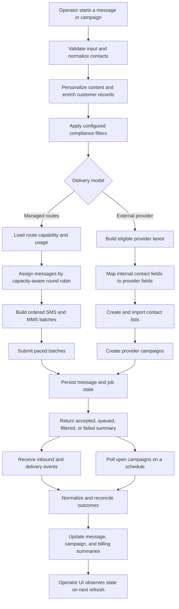

# ALL SMS — Technical Deep Dive

This document expands on the architecture in the main case study. It contains sanitized pseudocode and conceptual data flows only. Names, identifiers, provider protocols, production configuration, and source-level implementation details have been deliberately abstracted.

## 1. Dual-Path Orchestration

The outbound workflow begins with shared preparation and branches only at the delivery boundary.

### End-to-end campaign lifecycle — implemented



The standalone source is available in [`../diagrams/message-campaign-flow.mmd`](../diagrams/message-campaign-flow.mmd).

### Shared preparation — implemented

1. Accept a campaign file and message template.
2. Parse configured columns from the first worksheet.
3. Normalize contact numbers and reject invalid rows.
4. Create a persistent job record before delivery starts.
5. Render row-specific message content.
6. Upsert customer context.
7. Apply configured DNC/compliance filtering.
8. Route through either managed capacity or external-provider campaign lanes.
9. Persist message outcomes and update the job summary.

The common phase prevents each transport from reimplementing contact preparation and compliance behavior. The branch remains explicit because the delivery semantics are genuinely different.

### Managed-route path — implemented

Managed delivery is synchronous at batch-submission time. Each message is assigned to a route and the downstream gateway returns per-message acceptance information.

Inputs to route selection include:

- route availability;
- current usage;
- SMS unit capacity;
- MMS capability and capacity;
- sender/port assignment; and
- the number of SMS segments required by the message.

### External-provider path — implemented

Provider campaign delivery is a multi-step remote workflow:

1. synchronize active sender inventory;
2. find an eligible provider account and synchronized template;
3. load the configured contact-field mapping;
4. distribute rows across active provider lanes;
5. create a provider-side contact list;
6. upload mapped contact data;
7. create the campaign; and
8. persist provider references for later reconciliation.

Acceptance means queued or submitted, not delivered. Final state arrives later through callbacks or scheduled status polling.

### Single-message path — implemented

Operator replies take a shorter branch through the same delivery-model decision. A managed-route reply is submitted to the selected route and correlated with its response. A provider-backed reply resolves the assigned account and remote conversation context before submission. Successful submissions update the relevant usage and account state without running the full file-based campaign workflow.

## 2. Capacity-Aware Routing and Batching

### Allocation model

The managed-route allocator works with normalized route records containing total capacity, usage already consumed, capability flags, and counters for the current job.

SMS capacity is measured in message units rather than contact count. A long message can consume multiple units:

```text
units(message) = ceiling(character_count(message) / configured_segment_length)
```

The production implementation uses a simple segment-length approximation. A future implementation could calculate encoding-aware GSM/UCS-2 segment sizes.

### Sanitized routing pseudocode

```text
sms_cursor = 0
mms_cursor = 0

for each pending_message:
    if sms_routes are available:
        units = sms_units(pending_message)
        route = next_round_robin_route_with_capacity(
            sms_routes,
            sms_cursor,
            units
        )

        if route exists:
            assign pending_message to route
            decrement route.sms_remaining by units
            increment route.job_sms_units by units
            advance sms_cursor
            continue

    if mms_routes are available:
        route = next_round_robin_route_with_capacity(
            mms_routes,
            mms_cursor,
            1
        )

        if route exists:
            assign pending_message as MMS
            decrement route.mms_remaining
            increment route.job_mms_count
            advance mms_cursor
            continue

    mark pending_message as over-capacity or unroutable
```

This makes the routing decision deterministic from the route snapshot while distributing work rather than exhausting the first available port.

### Ordered batch construction

After allocation, messages are grouped by route and media type. The batch builder takes one chunk from each route in turn:

```text
while any route queue contains messages:
    for each route queue:
        take up to configured_chunk_size messages
        append that chunk to the ordered batch list
```

Submission then walks the ordered list sequentially with configurable pacing and jitter. Per-message status results are correlated back to the original message records.

### Tradeoff

Sequential pacing is operationally conservative and easier to reason about when downstream devices have strict limits. It does not maximize throughput. Controlled concurrency could be introduced later, but only with route-specific concurrency limits, idempotent submission, and durable retry state.

## 3. Configuration-Driven Provider Integration

Provider-specific configuration is composed from a normalized provider key and a logical operation name. Configuration supplies the base URL, endpoint template, header template, optional payload template, and pacing interval.

### Sanitized request-resolution pseudocode

```text
function resolve_provider_request(account, operation, placeholders):
    provider_key = normalize(account.provider)

    base_url = settings[provider_key + ".base_url"]
    endpoint = settings[provider_key + "." + operation + ".endpoint"]
    headers = settings[provider_key + ".headers"]
    payload = settings[provider_key + "." + operation + ".payload"]

    assert required configuration exists

    return {
        url: substitute_url_placeholders(base_url + endpoint, placeholders),
        headers: substitute_secret_and_value_placeholders(headers, account, placeholders),
        body: substitute_payload_placeholders(payload, placeholders),
        timeout: configured_timeout,
        minimum_interval: configured_request_interval
    }
```

The caller applies the minimum interval, constructs JSON or multipart data, performs the HTTP request, and returns a normalized response to the orchestration layer.

### Sender-inventory synchronization

Active sending numbers are fetched per provider account, including pagination. Replacement of the locally active inventory is transactional and occurs only after every account for that provider has synchronized successfully. A partial remote failure therefore does not incorrectly deactivate valid numbers discovered through another account.

### Field mapping

Internal spreadsheet fields are mapped to provider column names and provider API mapping keys. Campaign code can build standards-compliant CSV without embedding one provider's column vocabulary into the shared workflow.

### Tradeoff

Configuration-driven integration reduces code duplication, but configuration becomes executable behavior. It therefore needs schema validation, secret-safe diagnostics, versioning, and contract tests. Those controls are important future hardening work.

## 4. Inbound Normalization and Reconciliation

The listener accepts two broad event families:

- device-originated status and inbound-message events; and
- external-provider webhook events for inbound messages or outbound delivery state.

### Normalization pipeline — implemented

```text
parse request body
classify event as inbound, delivery, or irrelevant

if inbound:
    normalize sender and receiver
    resolve owning user/account from the receiving route
    reject or mark invalid numbers
    evaluate stop/DNC content
    upsert customer state
    deduplicate the message
    persist the inbound record
    optionally trigger configured AI notification behavior

if delivery:
    normalize provider status
    locate candidate outbound records
    update delivery result only when the transition is applicable
    update campaign and billing summaries
```

Normalization accepts variations in event naming, nesting, timestamps, and phone formatting, then translates them into the application's stable message state.

### Duplicate handling

When a provider event identifier is present, it is used as a deduplication signal. Inbound messages also use a bounded comparison of user, sender, receiver, content, and timestamp. Delivery billing checks whether the matching record has already been marked paid before applying another deduction.

### Scheduled reconciliation — implemented

Some providers expose campaign totals more reliably through a status endpoint than through individual delivery events. A scheduled job selects non-final campaigns that have not been checked recently, queries current totals, maps provider state into application state, marks newly delivered or failed records, and updates the parent job summary.

Webhook processing and status polling converge on the same persisted records. This gives the system two paths to eventual accuracy without treating either a campaign-creation response or one callback as complete truth.

### Current limitation

Reconciliation is scheduled inside one listener process and does not use a distributed lease. Multiple listener instances would require explicit job ownership to prevent overlapping work.

## 5. Payment Idempotency and Transaction Boundaries

The checkout flow creates a hosted payment session with application ownership metadata. The payment platform later calls a webhook that is verified with its signing secret before any database change is attempted.

Payment application uses a unique external payment reference and one database transaction:

```text
verify webhook signature
verify completed and paid state

begin transaction

insert payment using unique external reference

if insert was a duplicate:
    rollback
    return success without adding credits again

derive purchased credits from trusted payment metadata
increment organization balance

commit transaction
```

This closes the race created by a separate “check then insert” sequence. Concurrent retries cannot both create the unique payment record, and the payment record cannot commit without its associated balance update.

The broader messaging lifecycle contains other multi-write transitions that do not yet have an equivalent transaction or outbox boundary. Consolidating those transitions is a future reliability improvement.

## 6. Historical Data and Query Strategy

### Date-oriented records — implemented

Outbound records are written to date-named physical shards. When a new daily shard is created, an aggregate view is refreshed for broader querying. Analytics paths independently discover shards whose encoded dates overlap the requested interval.

Sanitized selection logic:

```text
candidate_shards = list_message_shards()

selected_shards = candidate_shards.filter(
    shard_date_range overlaps requested_date_range
)

if selected_shards is empty and base_table exists:
    selected_shards = [base_table]

query = union_all(
    parameterized_select(shard, users, start_time, end_time)
    for shard in selected_shards
)
```

Dynamic table identifiers are selected from database metadata rather than contact input. User and date values are passed as query parameters.

### Conversation cache — implemented

The API loads current messages on each refresh and maintains a per-user historical working set. Historical data is loaded once for a bounded recent period, paged into responses, and invalidated when stale or after a relevant login boundary.

The design reduces repeated historical reads during frequent UI polling. Its limitation is that cache state belongs to one Node.js process and is not automatically coherent across multiple application instances.

### Tradeoff

Application-managed sharding made date-bounded data operationally visible and allowed targeted queries. It also introduced shard discovery, dynamic union construction, view refresh, and archival complexity. A future design should compare this approach with native database partitioning and a formal retention policy.

## 7. Sessions, API Boundaries, and UI State

### Sessions — implemented

The API uses server-side sessions stored in the relational database. OAuth and local authentication both resolve into one application session shape. The frontend checks that session at startup and sends cookies with API requests.

A process-local session helper exposes the canonical user context to controllers and caches selected high-churn fields. The persistence and cache layers serve different purposes: the database survives process restarts, while the cache avoids repeated reconstruction inside a running process.

### API boundary — implemented

REST controllers group authentication, conversations, campaigns, reporting, templates, payments, and integration operations. Session context is resolved on the server before protected business workflows run. As the platform evolves, narrower resource contracts and more consistent input schemas would reduce coupling between controllers and data operations.

### UI state — implemented

React context holds the authenticated user, while component state holds conversations, campaign forms, analytics filters, and dialogs. The browser periodically requests server state rather than treating local state as authoritative.

## 8. Process and Deployment Boundaries

The current deployment unit consists of two long-running services:

- the application API, which serves interactive workflows; and
- the listener, which handles inbound events and scheduled reconciliation.

Both are compatible with a process supervisor and use structured logging. Database connectivity is pooled and established through a secured connectivity layer.

### Implementation boundaries

The service separation keeps inbound callbacks and scheduled reconciliation out of the interactive API process, but it is not yet a distributed worker model. Bulk execution begins in the API request, reconciliation ownership belongs to one listener process, and browser message updates use polling.

Device-status ingestion is only partially persisted. AI suggestions are implemented, while the email-based approval loop is partially connected and should be treated as experimental. These boundaries are kept explicit so existing behavior is not confused with planned functionality.
